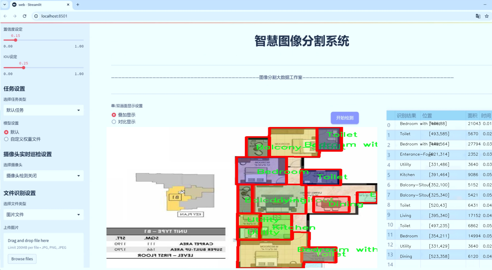
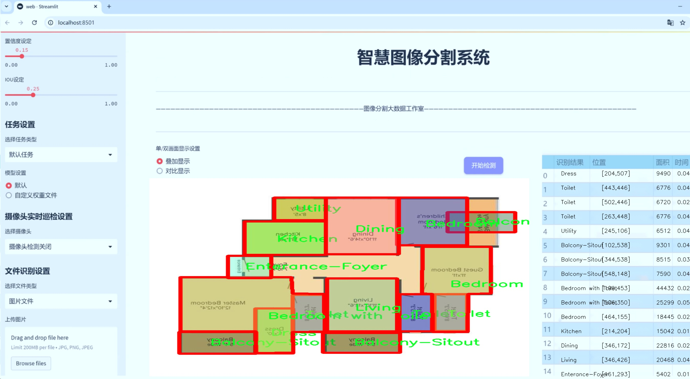
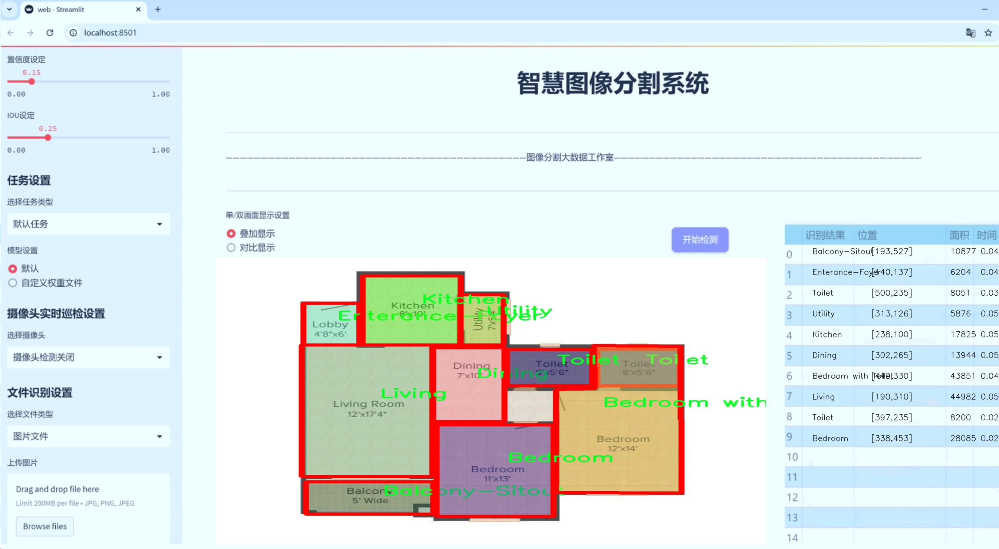
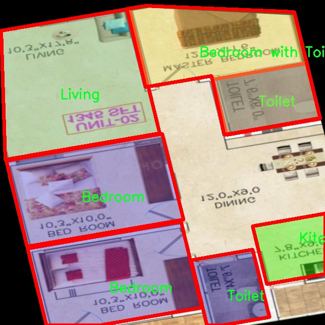
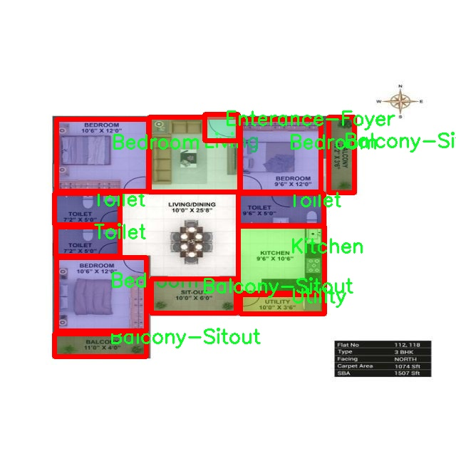
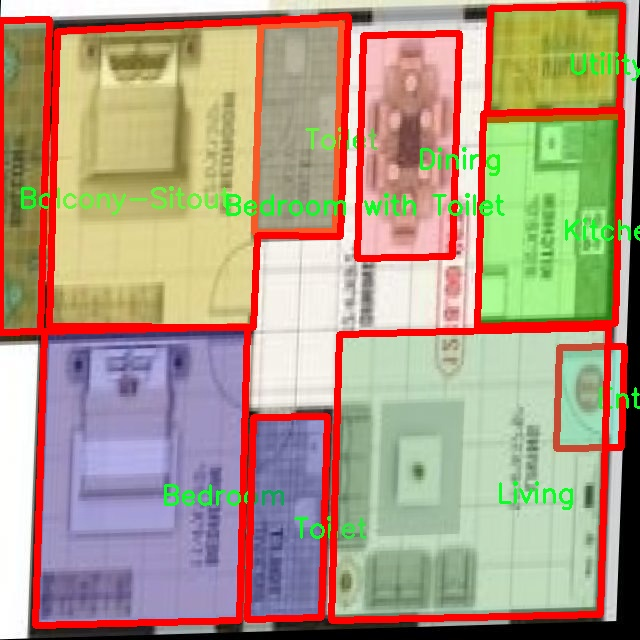
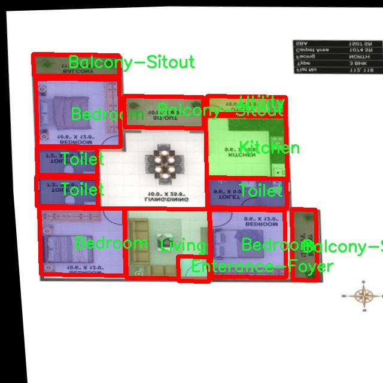
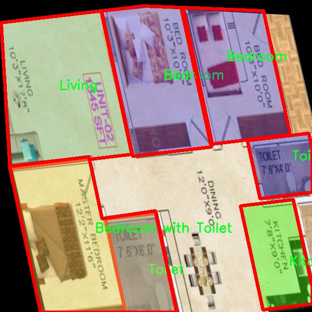

# 户型图室内空间图像分割系统源码＆数据集分享
 [yolov8-seg-C2f-EMSC＆yolov8-seg-C2f-SCcConv等50+全套改进创新点发刊_一键训练教程_Web前端展示]

### 1.研究背景与意义

项目参考[ILSVRC ImageNet Large Scale Visual Recognition Challenge](https://gitee.com/YOLOv8_YOLOv11_Segmentation_Studio/projects)

项目来源[AAAI Global Al lnnovation Contest](https://kdocs.cn/l/cszuIiCKVNis)

研究背景与意义

随着城市化进程的加快，室内空间的合理利用和优化设计变得愈发重要。尤其是在住宅设计中，户型图的分析与优化不仅影响居住者的生活质量，也对建筑行业的可持续发展具有深远的影响。传统的户型图分析方法往往依赖于人工经验，效率低下且容易受到主观因素的影响。因此，开发一种高效、准确的室内空间图像分割系统，能够自动识别和分类不同功能区域，显得尤为重要。

近年来，深度学习技术的迅猛发展为图像处理领域带来了革命性的变化。尤其是YOLO（You Only Look Once）系列模型，以其高效的实时目标检测能力，广泛应用于各类图像识别任务中。YOLOv8作为该系列的最新版本，具备更强的特征提取能力和更高的检测精度，能够在复杂环境中实现快速、准确的目标识别。因此，基于改进YOLOv8的户型图室内空间图像分割系统的研究，不仅能够提升室内空间分析的自动化水平，还能为建筑设计提供科学依据。

本研究所使用的数据集包含1100幅图像，涵盖12个不同的室内空间类别，包括阳台、卧室、餐厅、厨房等。这些类别的多样性为模型的训练提供了丰富的样本，有助于提高分割系统的泛化能力。通过对这些图像进行实例分割，系统能够准确识别每个功能区域，并为后续的空间布局优化提供数据支持。此外，数据集中包含的多样化室内空间布局，能够帮助模型学习到不同空间配置的特征，从而提升其在实际应用中的适应性。

在实际应用中，基于改进YOLOv8的室内空间图像分割系统不仅可以用于户型图的自动分析，还可以在智能家居、室内设计、虚拟现实等领域发挥重要作用。例如，在智能家居系统中，准确的空间分割能够为智能设备的布局和控制提供依据，从而提升居住者的生活体验。在室内设计中，设计师可以利用该系统快速获取空间信息，辅助决策，提高设计效率。此外，随着虚拟现实技术的发展，基于精确空间分割的虚拟环境构建也将成为可能，为用户提供更加沉浸式的体验。

综上所述，基于改进YOLOv8的户型图室内空间图像分割系统的研究，不仅具有重要的理论意义，也具备广泛的应用前景。通过实现室内空间的自动化分析与优化，本研究将为建筑设计、智能家居及相关领域的发展提供新的思路和方法，推动相关技术的进步与应用。

### 2.图片演示







##### 注意：由于此博客编辑较早，上面“2.图片演示”和“3.视频演示”展示的系统图片或者视频可能为老版本，新版本在老版本的基础上升级如下：（实际效果以升级的新版本为准）

  （1）适配了YOLOV8的“目标检测”模型和“实例分割”模型，通过加载相应的权重（.pt）文件即可自适应加载模型。

  （2）支持“图片识别”、“视频识别”、“摄像头实时识别”三种识别模式。

  （3）支持“图片识别”、“视频识别”、“摄像头实时识别”三种识别结果保存导出，解决手动导出（容易卡顿出现爆内存）存在的问题，识别完自动保存结果并导出到tempDir中。

  （4）支持Web前端系统中的标题、背景图等自定义修改，后面提供修改教程。

  另外本项目提供训练的数据集和训练教程,暂不提供权重文件（best.pt）,需要您按照教程进行训练后实现图片演示和Web前端界面演示的效果。

### 3.视频演示

[3.1 视频演示](https://www.bilibili.com/video/BV1ESyiYHESr/)

### 4.数据集信息展示

##### 4.1 本项目数据集详细数据（类别数＆类别名）

nc: 12
names: ['Balcony-Sitout', 'Bedroom', 'Bedroom with Toilet', 'Dining', 'Dress', 'Enterance-Foyer', 'Kitchen', 'Living', 'Pooja', 'Toilet', 'Utility', 'object']


##### 4.2 本项目数据集信息介绍

数据集信息展示

在本研究中，我们采用了名为“Floor”的数据集，以训练和改进YOLOv8-seg模型，旨在实现对户型图室内空间的高效图像分割。该数据集的设计充分考虑了室内空间的多样性与复杂性，包含了12个不同的类别，分别为：阳台（Balcony-Sitout）、卧室（Bedroom）、带卫生间的卧室（Bedroom with Toilet）、餐厅（Dining）、衣帽间（Dress）、入口/门厅（Enterance-Foyer）、厨房（Kitchen）、客厅（Living）、祈祷室（Pooja）、卫生间（Toilet）、杂物间（Utility）以及其他物体（object）。这些类别的选择不仅反映了现代住宅的常见布局，还考虑到了不同功能空间的实际应用场景，为模型的训练提供了丰富的样本。

“Floor”数据集的构建旨在捕捉室内空间的细节与特征，确保每个类别的样本数量和质量均衡。每个类别都包含了多样化的图像，这些图像来源于不同的室内环境，涵盖了各种风格和布局。这种多样性使得模型在训练过程中能够学习到更为广泛的特征，从而提高其在实际应用中的泛化能力。通过对不同类别的图像进行标注，我们能够为YOLOv8-seg模型提供清晰的目标检测和分割信息，确保模型在面对真实场景时能够准确识别和分割各个室内空间。

在数据集的标注过程中，我们采用了精细化的标注策略，确保每个类别的边界清晰且准确。这种高质量的标注不仅有助于提高模型的训练效果，还能在后续的推理阶段提升分割结果的精度。此外，为了增强模型的鲁棒性，我们还进行了数据增强处理，包括旋转、缩放、翻转等操作，以模拟不同的拍摄角度和光照条件。这一过程使得数据集更加丰富多样，进一步提升了模型的适应能力。

在训练过程中，我们将“Floor”数据集与YOLOv8-seg模型相结合，利用其先进的特征提取和分割能力，力求实现对室内空间的精准分割。通过不断迭代训练和优化，我们期望模型能够在不同的室内环境中，快速而准确地识别出各个功能区域。这不仅有助于室内设计、空间规划等领域的应用，也为智能家居、虚拟现实等技术的发展提供了重要的支持。

总之，“Floor”数据集的构建与应用为改进YOLOv8-seg的户型图室内空间图像分割系统提供了坚实的基础。通过对多样化室内空间的深入分析与学习，我们希望能够推动室内空间智能识别技术的发展，为未来的智能家居和室内设计提供更为高效的解决方案。











### 5.全套项目环境部署视频教程（零基础手把手教学）

[5.1 环境部署教程链接（零基础手把手教学）](https://www.bilibili.com/video/BV1jG4Ve4E9t/?vd_source=bc9aec86d164b67a7004b996143742dc)


[5.2 安装Python虚拟环境创建和依赖库安装视频教程链接（零基础手把手教学）](https://www.bilibili.com/video/BV1nA4VeYEze/?vd_source=bc9aec86d164b67a7004b996143742dc)

### 6.手把手YOLOV8-seg训练视频教程（零基础小白有手就能学会）

[6.1 手把手YOLOV8-seg训练视频教程（零基础小白有手就能学会）](https://www.bilibili.com/video/BV1cA4VeYETe/?vd_source=bc9aec86d164b67a7004b996143742dc)


按照上面的训练视频教程链接加载项目提供的数据集，运行train.py即可开始训练



     Epoch   gpu_mem       box       obj       cls    labels  img_size
     1/200     0G   0.01576   0.01955  0.007536        22      1280: 100%|██████████| 849/849 [14:42<00:00,  1.04s/it]
               Class     Images     Labels          P          R     mAP@.5 mAP@.5:.95: 100%|██████████| 213/213 [01:14<00:00,  2.87it/s]
                 all       3395      17314      0.994      0.957      0.0957      0.0843

     Epoch   gpu_mem       box       obj       cls    labels  img_size
     2/200     0G   0.01578   0.01923  0.007006        22      1280: 100%|██████████| 849/849 [14:44<00:00,  1.04s/it]
               Class     Images     Labels          P          R     mAP@.5 mAP@.5:.95: 100%|██████████| 213/213 [01:12<00:00,  2.95it/s]
                 all       3395      17314      0.996      0.956      0.0957      0.0845

     Epoch   gpu_mem       box       obj       cls    labels  img_size
     3/200     0G   0.01561    0.0191  0.006895        27      1280: 100%|██████████| 849/849 [10:56<00:00,  1.29it/s]
               Class     Images     Labels          P          R     mAP@.5 mAP@.5:.95: 100%|███████   | 187/213 [00:52<00:00,  4.04it/s]
                 all       3395      17314      0.996      0.957      0.0957      0.0845


### 7.50+种全套YOLOV8-seg创新点代码加载调参视频教程（一键加载写好的改进模型的配置文件）

[7.1 50+种全套YOLOV8-seg创新点代码加载调参视频教程（一键加载写好的改进模型的配置文件）](https://www.bilibili.com/video/BV1Hw4VePEXv/?vd_source=bc9aec86d164b67a7004b996143742dc)

### 8.YOLOV8-seg图像分割算法原理

原始YOLOV8-seg算法原理

YOLOv8-seg算法是Ultralytics公司在2023年推出的最新版本，标志着YOLO系列目标检测和图像分割技术的又一次重大飞跃。YOLOv8的设计理念围绕着快速、准确和易于使用的目标检测与图像分割任务展开，结合了先进的深度学习技术和创新的网络结构，极大地提升了性能和灵活性。

在YOLOv8的网络结构中，输入部分的设计尤为重要。默认情况下，YOLOv8接受640x640像素的图像输入，但为了适应不同长宽比的图像，算法采用了自适应图片缩放技术。这种方法通过将较长的一边按比例缩小到指定尺寸，然后对缩小后的短边进行填充，从而有效减少了信息冗余，提升了目标检测和推理的速度。此外，在训练过程中，YOLOv8引入了Mosaic数据增强技术。这一技术通过随机选择四张训练图像，进行缩放和拼接，生成新的训练样本。这种方法不仅丰富了训练数据的多样性，还迫使模型学习不同位置和周围像素的特征，从而提高了模型的预测精度。

YOLOv8的主干网络（Backbone）部分是其核心之一。与前几代YOLO版本相比，YOLOv8在主干网络中引入了C2F模块，取代了YOLOv5中的C3模块。C2F模块的设计灵感来源于YOLOv7中的ELAN结构，通过增加更多的梯度流分支，保证了轻量化的同时获得了更丰富的特征信息。这种结构不仅提高了特征提取的能力，还为后续的目标检测提供了更强的支持。YOLOv8还采用了空间金字塔池化（SPPF）模块，进一步增强了特征图的处理能力，使得网络能够更好地应对不同尺度的目标。

在特征融合阶段（Neck），YOLOv8采用了路径聚合网络（PAN）结构，旨在增强网络对不同尺度对象的特征融合能力。通过结合特征金字塔和路径聚合的优势，YOLOv8能够更有效地传递语义和定位特征，从而提升整体的检测性能。这一阶段的设计不仅考虑了特征的多样性，还确保了特征信息的丰富性，使得模型在处理复杂场景时依然能够保持高效的检测能力。

YOLOv8的头部网络（Head）是其创新的另一个重要方面。YOLOv8从传统的耦合头（Coupled-Head）结构转变为解耦头（Decoupled-Head）结构。这一变化使得检测和分类过程能够独立进行，输入特征图首先通过两个1x1的卷积模块进行降维，然后分别进行类别预测和边界框位置预测。这种解耦设计不仅提高了模型的灵活性，还使得损失函数的设计更加合理。YOLOv8中取消了Obj分支，分类分支依然采用二元交叉熵损失（BCELoss），而边界框回归分支则结合了分布焦点损失（DFL）和完全交并比损失（CIoULoss），旨在快速聚焦于标签附近的数值，提高预测的准确性。

值得注意的是，YOLOv8摒弃了以往的基于锚框（Anchor-Based）的方法，转而采用无锚框（Anchor-Free）检测策略。这一创新使得目标检测的过程更加简化，不再需要在训练之前对数据集进行锚框的聚类，从而提高了模型的泛化能力和结构的简洁性。通过将目标检测转化为关键点检测，YOLOv8能够在不同场景下实现更高效的目标定位和识别。

综上所述，YOLOv8-seg算法通过对输入、主干网络、特征融合和头部网络的全面优化，展现了在目标检测和图像分割任务中的卓越性能。其创新的设计理念和结构调整，使得YOLOv8不仅在精度和速度上有了显著提升，还在实际应用中展现了更强的灵活性和适应性。这些改进使得YOLOv8成为了目标检测领域中的一款强大工具，能够广泛应用于各种实际场景中，如自动驾驶、安防监控、医疗影像分析等，为推动计算机视觉技术的发展做出了重要贡献。


### 9.系统功能展示（检测对象为举例，实际内容以本项目数据集为准）

图9.1.系统支持检测结果表格显示

  图9.2.系统支持置信度和IOU阈值手动调节

  图9.3.系统支持自定义加载权重文件best.pt(需要你通过步骤5中训练获得)

  图9.4.系统支持摄像头实时识别

  图9.5.系统支持图片识别

  图9.6.系统支持视频识别

  图9.7.系统支持识别结果文件自动保存

  图9.8.系统支持Excel导出检测结果数据


### 10.50+种全套YOLOV8-seg创新点原理讲解（非科班也可以轻松写刊发刊，V11版本正在科研待更新）

#### 10.1 由于篇幅限制，每个创新点的具体原理讲解就不一一展开，具体见下列网址中的创新点对应子项目的技术原理博客网址【Blog】：


[10.1 50+种全套YOLOV8-seg创新点原理讲解链接](https://gitee.com/qunmasj/good)

#### 10.2 部分改进模块原理讲解(完整的改进原理见上图和技术博客链接)【如果此小节的图加载失败可以通过CSDN或者Github搜索该博客的标题访问原始博客，原始博客图片显示正常】
### YOLOv8简介

YOLOv8是一种最新的SOTA算法，提供了N/S/M/L/X尺度的不同大小模型，以满足不同场景的需求。本章对算法网络的新特性进行简要介绍。


1）骨干网络和Neck
开发者设计了C2f模块对CSPDarkNet 53和PAFPN进行改造。相比C3模块，C2f模块拥有更多的分支跨层链接，使模型的梯度流更加丰富，显著增强了模型的特征提取能力。
2)Head部分
Head部分采用无锚框设计，将分类任务和回归任务进行了解耦，独立的分支将更加专注于其所负责的特征信息。
3）损失计算
模型使用CIOU Loss作为误差损失函数，并通过最小化DFL进一步提升边界框的回归精度。同时模型采用了TaskAlignedAssigner样本分配策略，以分类得分和IOU的高阶组合作为指标指导正负样本选择，实现了高分类得分和高IOU的对齐，有效地提升了模型的检测精度。


### D-LKA Attention简介
自2010年代中期以来，卷积神经网络（CNNs）已成为许多计算机视觉应用的首选技术。它们能够从原始数据中自动提取复杂的特征表示，无需手动进行特征工程，这引起了医学图像分析社区的极大兴趣。许多成功的CNN架构，如U-Net、全卷积网络、DeepLab或SegCaps（分割胶囊），已经被开发出来。这些架构在语义分割任务中取得了巨大成功，先前的最新方法已经被超越。

在计算机视觉研究中，不同尺度下的目标识别是一个关键问题。在CNN中，可检测目标的大小与相应网络层的感受野尺寸密切相关。如果一个目标扩展到超出这个感受野的边界，这可能会导致欠分割结果。相反，与目标实际大小相比使用过大的感受野可能会限制识别，因为背景信息可能会对预测产生不必要的影响。

解决这个问题的一个有希望的方法涉及在并行使用具有不同尺寸的多个Kernel，类似于Inception块的机制。然而，由于参数和计算要求的指数增长，将Kernel大小增加以容纳更大的目标在实践中受到限制。因此，出现了各种策略，包括金字塔池化技术和不同尺度的扩张卷积，以捕获多尺度的上下文信息。

另一个直观的概念涉及将多尺度图像金字塔或它们的相关特征表示直接纳入网络架构。然而，这种方法存在挑战，特别是在管理训练和推理时间方面的可行性方面存在挑战。在这个背景下，使用编码器-解码器网络，如U-Net，已被证明是有利的。这样的网络在较浅的层中编码外观和位置，而在更深的层中，通过神经元的更广泛的感受野捕获更高的语义信息和上下文信息。

一些方法将来自不同层的特征组合在一起，或者预测来自不同尺寸的层的特征以使用多尺度的信息。此外，出现了从不同尺度的层中预测特征的方法，有效地实现了跨多个尺度的见解整合。然而，大多数编码器-解码器结构面临一个挑战：它们经常无法在不同尺度之间保持一致的特征，并主要使用最后一个解码器层生成分割结果。

语义分割是一项任务，涉及根据预定义的标签集为图像中的每个像素预测语义类别。这项任务要求提取高级特征同时保留初始的空间分辨率。CNNs非常适合捕获局部细节和低级信息，尽管以忽略全局上下文为代价。视觉Transformer（ViT）架构已经成为解决处理全局信息的视觉任务的关键，包括语义分割，取得了显著的成功。

ViT的基础是注意力机制，它有助于在整个输入序列上聚合信息。这种能力使网络能够合并远程的上下文提示，超越了CNN的有限感受野尺寸。然而，这种策略通常会限制ViT有效建模局部信息的能力。这种局限可能会妨碍它们检测局部纹理的能力，这对于各种诊断和预测任务至关重要。这种缺乏局部表示可以归因于ViT模型处理图像的特定方式。

ViT模型将图像分成一系列Patch，并使用自注意力机制来模拟它们之间的依赖关系。这种方法可能不如CNN模型中的卷积操作对感受野内提取局部特征有效。ViT和CNN模型之间的这种图像处理方法的差异可能解释了CNN模型在局部特征提取方面表现出色的原因。

近年来，已经开发出创新性方法来解决Transformer模型内部局部纹理不足的问题。其中一种方法是通过互补方法将CNN和ViT特征结合起来，以结合它们的优势并减轻局部表示的不足。TransUNet是这种方法的早期示例，它在CNN的瓶颈中集成了Transformer层，以模拟局部和全局依赖关系。HiFormer提出了一种解决方案，将Swin Transformer模块和基于CNN的编码器结合起来，生成两个多尺度特征表示，通过Double-Level Fusion模块集成。UNETR使用基于Transformer的编码器和CNN解码器进行3D医学图像分割。CoTr和TransBTS通过Transformer在低分辨率阶段增强分割性能，将CNN编码器和解码器连接在一起。

增强局部特征表示的另一种策略是重新设计纯Transformer模型内部的自注意力机制。在这方面，Swin-Unet在U形结构中集成了一个具有线性计算复杂性的Swin Transformer块作为多尺度 Backbone 。MISSFormer采用高效Transformer来解决视觉Transformer中的参数问题，通过在输入块上进行不可逆的降采样操作。D-Former引入了一个纯Transformer的管道，具有双重注意模块，以分段的方式捕获细粒度的局部注意和与多元单元的交互。然而，仍然存在一些特定的限制，包括计算效率低下，如TransUNet模型所示，对CNN Backbone 的严重依赖，如HiFormer所观察到的，以及对多尺度信息的忽略。

此外，目前的分割架构通常采用逐层处理3D输入 volumetric 的方法，无意中忽视了相邻切片之间的潜在相关性。这一疏忽限制了对 volumetric 信息的全面利用，因此损害了定位精度和上下文集成。此外，必须认识到，医学领域的病变通常在形状上发生变形。因此，用于医学图像分析的任何学习算法都必须具备捕捉和理解这些变形的能力。与此同时，该算法应保持计算效率，以便处理3D volumetric数据。

为了解决上述提到的挑战，作者提出了一个解决方案，即可变形大卷积核注意力模块（Deformable LKA module），它是作者网络设计的基本构建模块。这个模块明确设计成在有效处理上下文信息的同时保留局部描述符。作者的架构在这两个方面的平衡增强了实现精确语义分割的能力。

值得注意的是，参考该博客引入了一种基于数据的感受野的动态适应，不同于传统卷积操作中的固定滤波器Mask。这种自适应方法使作者能够克服与静态方法相关的固有限制。这种创新方法还扩展到了D-LKA Net架构的2D和3D版本的开发。

在3D模型的情况下，D-LKA机制被量身定制以适应3D环境，从而实现在不同 volumetric 切片之间无缝信息交互。最后，作者的贡献通过其计算效率得到进一步强调。作者通过仅依靠D-LKA概念的设计来实现这一点，在各种分割基准上取得了显著的性能，确立了作者的方法作为一种新的SOTA方法。

在本节中，作者首先概述方法论。首先，作者回顾了由Guo等人引入的大卷积核注意力（Large Kernel Attention，LKA）的概念。然后，作者介绍了作者对可变形LKA模块的创新探索。在此基础上，作者介绍了用于分割任务的2D和3D网络架构。

大卷积核提供了与自注意力机制类似的感受野。可以通过使用深度卷积、深度可扩展卷积和卷积来构建大卷积核，从而减少了参数和计算量。构建输入维度为和通道数的卷积核的深度卷积和深度可扩展卷积的卷积核大小的方程如下：


具有卷积核大小和膨胀率。参数数量和浮点运算（FLOPs）的计算如下：


FLOPs的数量与输入图像的大小成线性增长。参数的数量随通道数和卷积核大小的增加而呈二次增长。然而，由于它们通常都很小，因此它们不是限制因素。

为了最小化对于固定卷积核大小K的参数数量，可以将方程3对于膨胀率的导数设定为零：


例如，当卷积核大小为时，结果是。将这些公式扩展到3D情况是直接的。对于大小为和通道数C的输入，3D情况下参数数量和FLOPs 的方程如下：


具有卷积核大小和膨胀。


利用大卷积核进行医学图像分割的概念通过引入可变形卷积得以扩展。可变形卷积可以通过整数偏移自由调整采样网格以进行自由变形。额外的卷积层从特征图中学习出变形，从而创建一个偏移场。基于特征本身学习变形会导致自适应卷积核。这种灵活的卷积核形状可以提高病变或器官变形的表示，从而增强了目标边界的定义。

负责计算偏移的卷积层遵循其相应卷积层的卷积核大小和膨胀。双线性插值用于计算不在图像网格上的偏移的像素值。如图2所示，D-LKA模块可以表示为：


其中输入特征由表示，。表示为注意力图，其中每个值表示相应特征的相对重要性。运算符  表示逐元素乘法运算。值得注意的是，LKA不同于传统的注意力方法，它不需要额外的规范化函数，如或。这些规范化函数往往忽视高频信息，从而降低了基于自注意力的方法的性能。

在该方法的2D版本中，卷积层被可变形卷积所替代，因为可变形卷积能够改善对具有不规则形状和大小的目标的捕捉能力。这些目标在医学图像数据中常常出现，因此这种增强尤为重要。

然而，将可变形LKA的概念扩展到3D领域会带来一定的挑战。主要的约束来自于需要用于生成偏移的额外卷积层。与2D情况不同，由于输入和输出通道的性质，这一层无法以深度可分的方式执行。在3D环境中，输入通道对应于特征，而输出通道扩展到，其中是卷积核的大小。大卷积核的复杂性导致沿第3D的通道数扩展，导致参数和FLOPs大幅增加。因此，针对3D情况采用了另一种替代方法。在现有的LKA框架中，深度卷积之后引入了一个单独的可变形卷积层。这种战略性的设计调整旨在减轻扩展到3D领域所带来的挑战。


2D网络的架构如图1所示。第一变种使用MaxViT作为编码器组件，用于高效特征提取，而第二变种则结合可变形LKA层进行更精细、卓越的分割。

在更正式的描述中，编码器生成4个分层输出表示。首先，卷积干扰将输入图像的维度减小到。随后，通过4个MaxViT块的4个阶段进行特征提取，每个阶段后跟随降采样层。随着过程进展到解码器，实施了4个阶段的D-LKA层，每个阶段包含2个D-LKA块。然后，应用Patch扩展层以实现分辨率上采样，同时减小通道维度。最后，线性层负责生成最终的输出。

2D D-LKA块的结构包括LayerNorm、可变形LKA和多层感知器（MLP）。积分残差连接确保了有效的特征传播，即使在更深层也是如此。这个安排可以用数学方式表示为：


其中输入特征，层归一化LN，可变形LKA注意力，深度卷积，线性层和GeLU激活函数。

3D网络架构如图1所示，采用编码器-解码器设计进行分层结构化。首先，一个Patch嵌入层将输入图像的维度从（）减小到（）。在编码器中，采用了3个D-LKA阶段的序列，每个阶段包含3个D-LKA块。在每个阶段之后，通过降采样步骤将空间分辨率减半，同时将通道维度加倍。中央瓶颈包括另一组2个D-LKA块。解码器结构与编码器相对称。

为了将特征分辨率加倍，同时减少通道数，使用转置卷积。每个解码器阶段都使用3个D-LKA块来促进远距离特征依赖性。最终的分割输出由一个卷积层产生，后面跟随一个卷积层以匹配特定类别的通道要求。

为了建立输入图像和分割输出之间的直接连接，使用卷积形成了一个跳跃连接。额外的跳跃连接根据简单的加法对来自其他阶段的特征进行融合。最终的分割图是通过和卷积层的组合产生的。

3D D-LKA块包括层归一化，后跟D-LKA注意力，应用了残差连接的部分。随后的部分采用了一个卷积层，后面跟随一个卷积层，两者都伴随着残差连接。这个整个过程可以总结如下：


带有输入特征 、层归一化 、可变形 LKA 、卷积层 和输出特征 的公式。是指一个前馈网络，包括2个卷积层和激活函数。

表7显示了普通卷积和构建卷积的参数数量比较。尽管标准卷积的参数数量在通道数较多时急剧增加，但分解卷积的参数总体较低，并且增长速度不那么快。

与分解卷积相比，可变形分解卷积增加了大量参数，但仍然明显小于标准卷积。可变形卷积的主要参数是由偏移网络创建的。在这里，作者假设可变形深度卷积的Kernel大小为（5,5），可变形深度空洞卷积的Kernel大小为（7,7）。这导致了21×21大小的大Kernel的最佳参数数量。更高效地生成偏移量的方法将大大减少参数数量。


值得注意的是，引入可变形LKA确实会增加模型的参数数量和每秒的浮点运算次数（FLOPS）。然而，重要的是强调，这增加的计算负载不会影响作者模型的整体推理速度。

相反，对于Batch-size > 1，作者甚至观察到推理时间的减少，如图7所示。例如，基于作者的广泛实验，作者观察到对于Batch-size为16，具有可变形卷积和没有可变形卷积的推理时间分别为8.01毫秒和17.38毫秒。作者认为这是由于在2D中对可变形卷积的高效实现所致。为了测量时间，使用了大小为（）的随机输入。在GPU热身周期50次迭代之后，网络被推断了1000次。测量是在NVIDIA RTX 3090 GPU上进行的。


为了充分利用性能与参数之间的权衡关系，作者在图8中可视化了在Synapse 2D数据集上报告的DSC和HD性能以及基于参数数量的内存消耗。D-LKA Net引入了相当多的参数，约为101M。这比性能第二好的方法ScaleFormer使用的111.6M参数要少。

与更轻量级的DAEFormer模型相比，作者实现了更好的性能，这证明了参数增加的合理性。大多数参数来自于MaxViT编码器；因此，将编码器替换为更高效的编码器可以减少模型参数。值得注意的是，在此可视化中，作者最初将HD和内存值都归一化到[0, 100]范围内。随后，作者将它们从100缩小，以增强更高值的表示。


### 11.项目核心源码讲解（再也不用担心看不懂代码逻辑）

#### 11.1 ultralytics\models\sam\modules\tiny_encoder.py

以下是经过精简和注释的核心代码，保留了 TinyViT 模型的主要结构和功能：

```python
import itertools
import torch
import torch.nn as nn
import torch.nn.functional as F
import torch.utils.checkpoint as checkpoint

class Conv2d_BN(nn.Sequential):
    """执行2D卷积并随后进行批量归一化的序列容器。"""
    def __init__(self, in_channels, out_channels, kernel_size=1, stride=1, padding=0, dilation=1, groups=1, bn_weight_init=1):
        super().__init__()
        # 添加卷积层
        self.add_module('conv', nn.Conv2d(in_channels, out_channels, kernel_size, stride, padding, dilation, groups, bias=False))
        # 添加批量归一化层
        bn = nn.BatchNorm2d(out_channels)
        nn.init.constant_(bn.weight, bn_weight_init)
        nn.init.constant_(bn.bias, 0)
        self.add_module('bn', bn)

class PatchEmbed(nn.Module):
    """将图像嵌入为补丁并投影到指定的嵌入维度。"""
    def __init__(self, in_chans, embed_dim, resolution, activation):
        super().__init__()
        img_size = (resolution, resolution)  # 假设输入图像为正方形
        self.patches_resolution = (img_size[0] // 4, img_size[1] // 4)  # 计算补丁分辨率
        self.seq = nn.Sequential(
            Conv2d_BN(in_chans, embed_dim // 2, kernel_size=3, stride=2, padding=1),
            activation(),
            Conv2d_BN(embed_dim // 2, embed_dim, kernel_size=3, stride=2, padding=1),
        )

    def forward(self, x):
        """将输入张量 'x' 通过补丁嵌入模型的操作序列。"""
        return self.seq(x)

class MBConv(nn.Module):
    """移动反向瓶颈卷积层，属于高效网络架构的一部分。"""
    def __init__(self, in_chans, out_chans, expand_ratio, activation):
        super().__init__()
        self.conv1 = Conv2d_BN(in_chans, int(in_chans * expand_ratio), kernel_size=1)
        self.act1 = activation()
        self.conv2 = Conv2d_BN(int(in_chans * expand_ratio), int(in_chans * expand_ratio), kernel_size=3, padding=1, groups=int(in_chans * expand_ratio))
        self.act2 = activation()
        self.conv3 = Conv2d_BN(int(in_chans * expand_ratio), out_chans, kernel_size=1, bn_weight_init=0.0)
        self.act3 = activation()

    def forward(self, x):
        """实现模型架构的前向传播。"""
        shortcut = x
        x = self.conv1(x)
        x = self.act1(x)
        x = self.conv2(x)
        x = self.act2(x)
        x = self.conv3(x)
        x += shortcut  # 残差连接
        return self.act3(x)

class Attention(nn.Module):
    """多头注意力模块，支持空间感知。"""
    def __init__(self, dim, key_dim, num_heads=8):
        super().__init__()
        self.num_heads = num_heads
        self.scale = key_dim ** -0.5
        self.qkv = nn.Linear(dim, dim * 3)  # 生成查询、键、值

    def forward(self, x):
        """执行前向传播，计算注意力。"""
        B, N, _ = x.shape
        qkv = self.qkv(x).view(B, N, 3, self.num_heads, -1).transpose(2, 3)  # (B, N, num_heads, 3, head_dim)
        q, k, v = qkv.unbind(2)  # 分离查询、键、值
        attn = (q @ k.transpose(-2, -1)) * self.scale  # 计算注意力得分
        attn = attn.softmax(dim=-1)  # 归一化
        x = (attn @ v)  # 加权求和
        return x

class TinyViTBlock(nn.Module):
    """TinyViT块，应用自注意力和局部卷积。"""
    def __init__(self, dim, num_heads, window_size=7, mlp_ratio=4.):
        super().__init__()
        self.attn = Attention(dim, dim // num_heads, num_heads)
        self.mlp = nn.Sequential(
            nn.Linear(dim, int(dim * mlp_ratio)),
            nn.GELU(),
            nn.Linear(int(dim * mlp_ratio), dim)
        )
        self.local_conv = Conv2d_BN(dim, dim, kernel_size=3, padding=1)

    def forward(self, x):
        """应用注意力和局部卷积的前向传播。"""
        x = self.attn(x) + x  # 残差连接
        x = self.local_conv(x.view(x.size(0), x.size(1), int(x.size(1)**0.5), int(x.size(1)**0.5)))  # 重新调整形状以进行卷积
        return x + self.mlp(x)  # 残差连接

class TinyViT(nn.Module):
    """TinyViT架构用于视觉任务。"""
    def __init__(self, img_size=224, in_chans=3, num_classes=1000, embed_dims=[96, 192, 384, 768], depths=[2, 2, 6, 2], num_heads=[3, 6, 12, 24]):
        super().__init__()
        self.patch_embed = PatchEmbed(in_chans, embed_dims[0], img_size, nn.GELU)
        self.layers = nn.ModuleList([
            nn.ModuleList([TinyViTBlock(embed_dims[i], num_heads[i]) for _ in range(depths[i])])
            for i in range(len(depths))
        ])
        self.head = nn.Linear(embed_dims[-1], num_classes)

    def forward(self, x):
        """执行前向传播，经过补丁嵌入和各层。"""
        x = self.patch_embed(x)
        for layer in self.layers:
            for block in layer:
                x = block(x)
        return self.head(x.mean(dim=1))  # 全局平均池化后分类
```

### 代码说明：
1. **Conv2d_BN**: 定义了一个包含卷积和批量归一化的层。
2. **PatchEmbed**: 将输入图像分割成补丁并进行嵌入。
3. **MBConv**: 实现了移动反向瓶颈卷积，适用于高效网络。
4. **Attention**: 实现了多头注意力机制。
5. **TinyViTBlock**: 组合了注意力机制和局部卷积的块。
6. **TinyViT**: 整个模型架构，包含补丁嵌入、多个TinyViT块和分类头。

以上代码保留了TinyViT模型的核心功能，并添加了详细的中文注释以便理解。

该文件定义了一个名为 `TinyViT` 的深度学习模型架构，主要用于视觉任务。这个模型的设计灵感来源于 LeViT 和 Swin Transformer，并采用了一些高效的卷积结构，如 MBConv（Mobile Inverted Bottleneck Convolution），以及自注意力机制。以下是对文件中各个部分的详细说明。

首先，文件引入了一些必要的库，包括 PyTorch 和一些自定义的工具函数。接着，定义了一些基础的模块类，如 `Conv2d_BN`、`PatchEmbed`、`MBConv`、`PatchMerging`、`ConvLayer`、`Mlp`、`Attention`、`TinyViTBlock`、`BasicLayer`、`LayerNorm2d` 和最终的 `TinyViT` 类。

`Conv2d_BN` 类是一个简单的卷积层，后接批量归一化。它的构造函数接受多个参数，用于定义卷积的输入输出通道、卷积核大小、步幅、填充等，并初始化卷积层和批量归一化层。

`PatchEmbed` 类用于将输入图像分割成小块（patches），并将这些小块映射到一个指定的嵌入维度。它使用两个卷积层来实现这一功能，并在前向传播中执行这些操作。

`MBConv` 类实现了 MobileNetV3 中的倒置瓶颈卷积层，包含了多个卷积层和激活函数。它的设计允许在深度学习模型中有效地提取特征，并通过残差连接来增强信息流动。

`PatchMerging` 类用于合并相邻的特征块，并将其投影到新的维度。这一过程有助于在模型的不同层之间进行信息整合。

`ConvLayer` 类是一个包含多个 MBConv 层的卷积层，可以选择性地对输出进行下采样，并支持梯度检查点以节省内存。

`Mlp` 类实现了多层感知机（MLP），通常用于 Transformer 架构中。它包括层归一化和两个全连接层，并在每个层之间应用激活函数。

`Attention` 类实现了多头自注意力机制，支持空间感知，能够根据空间分辨率应用注意力偏置。它使用了可训练的注意力偏置，以增强模型的表现。

`TinyViTBlock` 类结合了自注意力和局部卷积的功能，能够对输入进行变换并提取特征。它的设计允许在不同的输入分辨率下灵活处理数据。

`BasicLayer` 类是 TinyViT 架构中的基本层，包含多个 TinyViTBlock。它支持在层之间进行下采样，并能够选择性地使用梯度检查点。

`LayerNorm2d` 类实现了二维的层归一化，用于在特征图上进行归一化处理。

最后，`TinyViT` 类是整个模型的核心，定义了模型的结构和前向传播逻辑。它接受多个参数，如输入图像大小、输入通道数、类别数、嵌入维度、层深度、注意力头数等。模型的构造过程包括创建各个层、初始化权重、设置学习率衰减等。

在前向传播中，输入首先通过 `PatchEmbed` 进行处理，然后依次通过各个层进行特征提取，最后通过分类头输出结果。整个模型的设计旨在实现高效的特征提取和分类能力，适用于各种视觉任务。

#### 11.2 ultralytics\nn\backbone\SwinTransformer.py

以下是经过简化和注释的核心代码部分，主要包括Swin Transformer的基本结构和关键模块。

```python
import torch
import torch.nn as nn
import torch.nn.functional as F
import numpy as np

class Mlp(nn.Module):
    """ 多层感知机 (MLP) 模块。 """

    def __init__(self, in_features, hidden_features=None, out_features=None, act_layer=nn.GELU, drop=0.):
        super().__init__()
        out_features = out_features or in_features  # 输出特征数默认为输入特征数
        hidden_features = hidden_features or in_features  # 隐藏层特征数默认为输入特征数
        self.fc1 = nn.Linear(in_features, hidden_features)  # 第一层线性变换
        self.act = act_layer()  # 激活函数
        self.fc2 = nn.Linear(hidden_features, out_features)  # 第二层线性变换
        self.drop = nn.Dropout(drop)  # Dropout层

    def forward(self, x):
        """ 前向传播函数。 """
        x = self.fc1(x)  # 线性变换
        x = self.act(x)  # 激活
        x = self.drop(x)  # Dropout
        x = self.fc2(x)  # 线性变换
        x = self.drop(x)  # Dropout
        return x


class WindowAttention(nn.Module):
    """ 基于窗口的多头自注意力 (W-MSA) 模块。 """

    def __init__(self, dim, window_size, num_heads, qkv_bias=True, attn_drop=0., proj_drop=0.):
        super().__init__()
        self.dim = dim  # 输入通道数
        self.window_size = window_size  # 窗口大小
        self.num_heads = num_heads  # 注意力头数

        # 定义查询、键、值的线性变换
        self.qkv = nn.Linear(dim, dim * 3, bias=qkv_bias)
        self.attn_drop = nn.Dropout(attn_drop)  # 注意力权重的Dropout
        self.proj = nn.Linear(dim, dim)  # 输出的线性变换
        self.proj_drop = nn.Dropout(proj_drop)  # 输出的Dropout

    def forward(self, x, mask=None):
        """ 前向传播函数。 """
        B_, N, C = x.shape  # B_: 批量大小, N: 序列长度, C: 通道数
        qkv = self.qkv(x).reshape(B_, N, 3, self.num_heads, C // self.num_heads).permute(2, 0, 3, 1, 4)
        q, k, v = qkv[0], qkv[1], qkv[2]  # 分离查询、键、值

        attn = (q @ k.transpose(-2, -1))  # 计算注意力得分
        attn = self.attn_drop(attn)  # 应用Dropout

        x = (attn @ v).transpose(1, 2).reshape(B_, N, C)  # 计算输出
        x = self.proj(x)  # 投影
        x = self.proj_drop(x)  # 应用Dropout
        return x


class SwinTransformerBlock(nn.Module):
    """ Swin Transformer的基本块。 """

    def __init__(self, dim, num_heads, window_size=7, shift_size=0, mlp_ratio=4., drop=0., attn_drop=0.):
        super().__init__()
        self.attn = WindowAttention(dim, window_size, num_heads, attn_drop=attn_drop)  # 注意力模块
        self.mlp = Mlp(in_features=dim, hidden_features=int(dim * mlp_ratio), drop=drop)  # MLP模块

    def forward(self, x):
        """ 前向传播函数。 """
        x = self.attn(x)  # 通过注意力模块
        x = x + self.mlp(x)  # 加上MLP的输出
        return x


class SwinTransformer(nn.Module):
    """ Swin Transformer主模型。 """

    def __init__(self, depths=[2, 2, 6, 2], num_heads=[3, 6, 12, 24], embed_dim=96):
        super().__init__()
        self.layers = nn.ModuleList()  # 存储各层
        for i in range(len(depths)):
            layer = SwinTransformerBlock(
                dim=int(embed_dim * 2 ** i),
                num_heads=num_heads[i],
                window_size=7,
                drop=0.1
            )
            self.layers.append(layer)  # 添加每一层

    def forward(self, x):
        """ 前向传播函数。 """
        for layer in self.layers:
            x = layer(x)  # 逐层传递
        return x


def SwinTransformer_Tiny():
    """ 创建一个小型的Swin Transformer模型。 """
    model = SwinTransformer(depths=[2, 2, 6, 2], num_heads=[3, 6, 12, 24])
    return model
```

### 代码注释说明：
1. **Mlp类**：实现了一个简单的多层感知机，包含两个线性层和一个激活函数，支持Dropout。
2. **WindowAttention类**：实现了窗口自注意力机制，计算输入的注意力得分并生成输出。
3. **SwinTransformerBlock类**：构建了Swin Transformer的基本块，包含注意力层和MLP层。
4. **SwinTransformer类**：构建了整个Swin Transformer模型，包含多个Swin Transformer块。
5. **SwinTransformer_Tiny函数**：用于创建一个小型的Swin Transformer模型实例。 

该代码实现了Swin Transformer的核心功能，适用于图像处理等任务。

这个程序文件实现了Swin Transformer模型的主要组件，主要用于计算机视觉任务。Swin Transformer是一种基于变换器（Transformer）的架构，具有层次化的特性和移动窗口的自注意力机制。以下是对代码的详细说明。

首先，文件导入了必要的库，包括PyTorch的核心模块和一些辅助函数。接着，定义了一个名为`Mlp`的类，它实现了一个多层感知机（MLP），包含两个线性层和一个激活函数（默认为GELU），并在每个线性层后应用了Dropout以防止过拟合。

接下来，定义了两个辅助函数`window_partition`和`window_reverse`，用于将输入特征图分割成小窗口以及将这些窗口合并回原来的特征图。这是Swin Transformer中窗口自注意力机制的基础。

`WindowAttention`类实现了窗口基础的多头自注意力机制（W-MSA），支持相对位置偏置。该类的构造函数中定义了输入通道数、窗口大小、注意力头数等参数，并初始化了相对位置偏置表和查询、键、值的线性变换。

`SwinTransformerBlock`类是Swin Transformer的基本构建块，包含一个窗口注意力层和一个MLP层。它实现了前向传播过程，并支持循环移位以实现SW-MSA（Shifted Window Multi-Head Self-Attention）。

`PatchMerging`类用于将特征图的补丁合并，通常在Swin Transformer的不同阶段之间进行下采样。

`BasicLayer`类表示Swin Transformer中的一个基本层，包含多个Swin Transformer块，并在最后可能包含一个下采样层。它计算了用于SW-MSA的注意力掩码，并在每个块中进行前向传播。

`PatchEmbed`类负责将输入图像分割成补丁并进行嵌入，使用卷积层将补丁映射到高维空间。

`SwinTransformer`类是整个模型的核心，负责构建整个Swin Transformer的架构，包括补丁嵌入、各个层的堆叠以及输出的规范化。构造函数中定义了模型的超参数，并根据深度和头数构建各个层。

最后，定义了一个`update_weight`函数，用于更新模型的权重，并提供了一个`SwinTransformer_Tiny`函数，用于创建一个小型的Swin Transformer模型实例。

整体来看，这个文件实现了Swin Transformer的完整结构，提供了多种灵活的配置选项，以便在不同的计算机视觉任务中使用。

#### 11.3 ui.py

以下是经过简化和注释的核心代码部分：

```python
import sys
import subprocess

def run_script(script_path):
    """
    使用当前 Python 环境运行指定的脚本。

    Args:
        script_path (str): 要运行的脚本路径

    Returns:
        None
    """
    # 获取当前 Python 解释器的路径
    python_path = sys.executable

    # 构建运行命令，使用 streamlit 运行指定的脚本
    command = f'"{python_path}" -m streamlit run "{script_path}"'

    # 执行命令并等待其完成
    result = subprocess.run(command, shell=True)
    
    # 检查命令执行的返回码，0 表示成功，非0表示出错
    if result.returncode != 0:
        print("脚本运行出错。")

# 主程序入口
if __name__ == "__main__":
    # 指定要运行的脚本路径
    script_path = "web.py"  # 这里可以直接指定脚本名

    # 调用函数运行脚本
    run_script(script_path)
```

### 代码注释说明：
1. **导入模块**：
   - `sys`：用于获取当前 Python 解释器的路径。
   - `subprocess`：用于执行外部命令。

2. **`run_script` 函数**：
   - 接受一个参数 `script_path`，表示要运行的 Python 脚本的路径。
   - 使用 `sys.executable` 获取当前 Python 解释器的路径。
   - 构建一个命令字符串，使用 `streamlit` 模块运行指定的脚本。
   - 使用 `subprocess.run` 执行命令，并等待其完成。
   - 检查命令的返回码，如果返回码不为 0，表示脚本运行出错，打印错误信息。

3. **主程序入口**：
   - 使用 `if __name__ == "__main__":` 确保代码仅在直接运行时执行。
   - 指定要运行的脚本路径（这里直接指定为 `"web.py"`）。
   - 调用 `run_script` 函数来执行指定的脚本。

这个程序文件名为 `ui.py`，主要功能是通过当前的 Python 环境来运行一个指定的脚本，具体是一个名为 `web.py` 的文件。程序的实现使用了 Python 的标准库，包括 `sys`、`os` 和 `subprocess`，同时还引入了一个自定义模块 `QtFusion.path` 中的 `abs_path` 函数。

在程序的开头，首先导入了所需的模块。`sys` 模块用于访问与 Python 解释器相关的变量和函数，`os` 模块提供了与操作系统交互的功能，而 `subprocess` 模块则用于执行外部命令。`abs_path` 函数的作用是获取给定路径的绝对路径。

接下来定义了一个名为 `run_script` 的函数，该函数接受一个参数 `script_path`，表示要运行的脚本的路径。在函数内部，首先获取当前 Python 解释器的路径，存储在 `python_path` 变量中。然后构建一个命令字符串，使用 `streamlit` 模块来运行指定的脚本。这个命令字符串使用了 Python 解释器的路径和脚本的路径。

使用 `subprocess.run` 方法执行构建好的命令，`shell=True` 参数允许在 shell 中执行命令。执行完命令后，检查返回的结果码，如果不为零，表示脚本运行出错，程序会输出相应的错误信息。

在文件的最后部分，使用 `if __name__ == "__main__":` 语句来确保只有在直接运行该脚本时才会执行以下代码。在这里，首先调用 `abs_path` 函数获取 `web.py` 的绝对路径，并将其赋值给 `script_path` 变量。然后调用 `run_script` 函数，传入 `script_path`，从而启动指定的脚本。

总体而言，这个程序的主要功能是封装了一个简单的接口，通过命令行启动一个 Streamlit 应用，方便用户在当前 Python 环境中运行指定的脚本。

#### 11.4 ultralytics\nn\extra_modules\head.py

以下是代码中最核心的部分，并附上详细的中文注释：

```python
import torch
import torch.nn as nn
from ultralytics.utils.tal import dist2bbox, make_anchors

class Detect_DyHead(nn.Module):
    """YOLOv8 检测头，使用 DyHead 进行目标检测。"""
    
    def __init__(self, nc=80, hidc=256, block_num=2, ch=()):
        super().__init__()
        self.nc = nc  # 类别数量
        self.nl = len(ch)  # 检测层的数量
        self.reg_max = 16  # DFL 通道数
        self.no = nc + self.reg_max * 4  # 每个锚点的输出数量
        self.stride = torch.zeros(self.nl)  # 构建时计算的步幅
        c2, c3 = max((16, ch[0] // 4, self.reg_max * 4)), max(ch[0], self.nc)  # 通道数
        self.conv = nn.ModuleList(nn.Sequential(Conv(x, hidc, 1)) for x in ch)  # 卷积层
        self.dyhead = nn.Sequential(*[DyHeadBlock(hidc) for i in range(block_num)])  # 动态头块
        self.cv2 = nn.ModuleList(
            nn.Sequential(Conv(hidc, c2, 3), Conv(c2, c2, 3), nn.Conv2d(c2, 4 * self.reg_max, 1)) for _ in ch)  # 生成框的卷积层
        self.cv3 = nn.ModuleList(nn.Sequential(Conv(hidc, c3, 3), Conv(c3, c3, 3), nn.Conv2d(c3, self.nc, 1)) for _ in ch)  # 类别的卷积层
        self.dfl = DFL(self.reg_max) if self.reg_max > 1 else nn.Identity()  # DFL 层

    def forward(self, x):
        """连接并返回预测的边界框和类别概率。"""
        for i in range(self.nl):
            x[i] = self.conv[i](x[i])  # 通过卷积层处理输入
        x = self.dyhead(x)  # 通过动态头块处理
        shape = x[0].shape  # 获取输出形状
        for i in range(self.nl):
            x[i] = torch.cat((self.cv2[i](x[i]), self.cv3[i](x[i])), 1)  # 连接生成框和类别的输出
        if self.training:
            return x  # 如果是训练模式，直接返回
        elif self.dynamic or self.shape != shape:
            # 动态或形状变化时，生成锚点和步幅
            self.anchors, self.strides = (x.transpose(0, 1) for x in make_anchors(x, self.stride, 0.5))
            self.shape = shape

        # 合并所有输出
        x_cat = torch.cat([xi.view(shape[0], self.no, -1) for xi in x], 2)
        box, cls = x_cat.split((self.reg_max * 4, self.nc), 1)  # 分割边界框和类别
        dbox = dist2bbox(self.dfl(box), self.anchors.unsqueeze(0), xywh=True, dim=1) * self.strides  # 转换为真实边界框
        y = torch.cat((dbox, cls.sigmoid()), 1)  # 合并边界框和类别概率
        return y  # 返回最终输出

    def bias_init(self):
        """初始化检测头的偏置，警告：需要步幅可用。"""
        m = self  # 当前模型
        for a, b, s in zip(m.cv2, m.cv3, m.stride):  # 对每个卷积层
            a[-1].bias.data[:] = 1.0  # 边界框偏置初始化
            b[-1].bias.data[:m.nc] = math.log(5 / m.nc / (640 / s) ** 2)  # 类别偏置初始化

# 其他类如 Detect_DyHeadWithDCNV3, Detect_AFPN_P345 等可根据需要添加，核心逻辑类似。
```

### 代码说明：
1. **Detect_DyHead 类**：这是 YOLOv8 检测头的实现，使用动态头（DyHead）来进行目标检测。
2. **构造函数 `__init__`**：初始化类的属性，包括类别数量、检测层数量、输出数量等，并定义卷积层和动态头块。
3. **`forward` 方法**：定义前向传播过程，处理输入数据并生成边界框和类别概率。根据训练模式的不同，返回不同的输出。
4. **`bias_init` 方法**：初始化偏置值，确保模型在训练开始时有合理的初始值。

以上是核心部分的详细注释，帮助理解 YOLOv8 检测头的工作原理。

这个程序文件定义了YOLOv8模型中的多个检测头（Detect Head），用于目标检测和分割任务。文件中包含多个类，每个类代表一种特定的检测头结构，主要包括`Detect_DyHead`、`Detect_AFPN_P345`、`Detect_Efficient`等。

首先，`Detect_DyHead`类是YOLOv8的动态检测头，主要用于目标检测。它的构造函数接收类别数量、隐藏通道数、块数量和通道数等参数。类中定义了多个层，包括卷积层和动态头块（`DyHeadBlock`），并在前向传播中对输入进行处理，最终输出预测的边界框和类别概率。在训练模式下，返回的是各层的输出；在推理模式下，会根据输入形状动态生成锚框，并计算最终的输出。

`Detect_DyHeadWithDCNV3`类是`Detect_DyHead`的扩展，使用了DCN（Deformable Convolutional Networks）来增强特征提取能力。

`Detect_AFPN_P345`类实现了带有自适应特征金字塔网络（AFPN）的检测头，旨在提升多尺度特征的融合能力。它的构造函数与`Detect_DyHead`类似，但使用了AFPN结构来处理输入特征。

`Detect_AFPN_P345_Custom`和`Detect_AFPN_P2345`类是对`Detect_AFPN_P345`的变体，分别提供了自定义的AFPN结构和支持更多层次的特征融合。

`Detect_Efficient`类实现了一种高效的检测头，使用了更简化的卷积结构，旨在提高计算效率。它的前向传播方法与其他检测头类似，处理输入并返回预测结果。

`DetectAux`类是一个辅助检测头，主要用于多任务学习，能够同时处理主任务和辅助任务的输出。

最后，`Segment_Efficient`类扩展了`Detect_Efficient`，用于分割任务，增加了对掩膜原型的支持，并在前向传播中返回掩膜系数。

整个文件的结构设计旨在提供灵活的检测头实现，支持不同的网络结构和任务需求。通过继承和组合不同的模块，用户可以根据具体应用场景选择合适的检测头。

#### 11.5 ultralytics\models\sam\model.py

以下是代码中最核心的部分，并附上详细的中文注释：

```python
from pathlib import Path
from ultralytics.engine.model import Model
from .build import build_sam
from .predict import Predictor

class SAM(Model):
    """
    SAM (Segment Anything Model) 接口类。

    SAM 旨在进行可提示的实时图像分割。可以使用多种提示方式，如边界框、点或标签。该模型具有零-shot 性能，并在 SA-1B 数据集上进行训练。
    """

    def __init__(self, model='sam_b.pt') -> None:
        """
        使用预训练模型文件初始化 SAM 模型。

        参数:
            model (str): 预训练 SAM 模型文件的路径。文件应具有 .pt 或 .pth 扩展名。

        异常:
            NotImplementedError: 如果模型文件扩展名不是 .pt 或 .pth。
        """
        # 检查模型文件的扩展名是否为 .pt 或 .pth
        if model and Path(model).suffix not in ('.pt', '.pth'):
            raise NotImplementedError('SAM 预测需要预训练的 *.pt 或 *.pth 模型。')
        # 调用父类构造函数，初始化模型
        super().__init__(model=model, task='segment')

    def predict(self, source, stream=False, bboxes=None, points=None, labels=None, **kwargs):
        """
        对给定的图像或视频源执行分割预测。

        参数:
            source (str): 图像或视频文件的路径，或 PIL.Image 对象，或 numpy.ndarray 对象。
            stream (bool, optional): 如果为 True，则启用实时流。默认为 False。
            bboxes (list, optional): 用于提示分割的边界框坐标列表。默认为 None。
            points (list, optional): 用于提示分割的点列表。默认为 None。
            labels (list, optional): 用于提示分割的标签列表。默认为 None。

        返回:
            (list): 模型的预测结果。
        """
        # 设置预测的默认参数
        overrides = dict(conf=0.25, task='segment', mode='predict', imgsz=1024)
        kwargs.update(overrides)  # 更新额外参数
        prompts = dict(bboxes=bboxes, points=points, labels=labels)  # 创建提示字典
        # 调用父类的预测方法
        return super().predict(source, stream, prompts=prompts, **kwargs)

    def __call__(self, source=None, stream=False, bboxes=None, points=None, labels=None, **kwargs):
        """
        'predict' 方法的别名。

        参数:
            source (str): 图像或视频文件的路径，或 PIL.Image 对象，或 numpy.ndarray 对象。
            stream (bool, optional): 如果为 True，则启用实时流。默认为 False。
            bboxes (list, optional): 用于提示分割的边界框坐标列表。默认为 None。
            points (list, optional): 用于提示分割的点列表。默认为 None。
            labels (list, optional): 用于提示分割的标签列表。默认为 None。

        返回:
            (list): 模型的预测结果。
        """
        return self.predict(source, stream, bboxes, points, labels, **kwargs)

    @property
    def task_map(self):
        """
        提供从 'segment' 任务到其对应 'Predictor' 的映射。

        返回:
            (dict): 将 'segment' 任务映射到其对应 'Predictor' 的字典。
        """
        return {'segment': {'predictor': Predictor}}
```

### 代码说明：
1. **类定义**：`SAM` 类继承自 `Model`，用于实现可提示的实时图像分割功能。
2. **初始化方法**：`__init__` 方法用于加载预训练模型，确保模型文件具有正确的扩展名。
3. **预测方法**：`predict` 方法用于对输入的图像或视频源进行分割预测，支持边界框、点和标签作为提示。
4. **调用方法**：`__call__` 方法是 `predict` 方法的别名，允许使用 `SAM` 实例直接进行预测。
5. **任务映射**：`task_map` 属性提供了任务到预测器的映射，便于管理不同的任务。

这个程序文件是Ultralytics YOLO框架中的一个模块，主要实现了Segment Anything Model（SAM）的接口，旨在进行实时图像分割任务。SAM模型具有高度的灵活性，能够进行可提示的分割，并且在SA-1B数据集上进行了训练。该模型的一个显著特点是具备零-shot性能，意味着它可以在没有先前知识的情况下适应新的图像分布和任务。

在代码中，首先导入了一些必要的库和模块，包括`Path`用于处理文件路径，`Model`类用于构建模型的基础，`model_info`用于获取模型信息，以及`build_sam`和`Predictor`用于构建SAM模型和进行预测。

SAM类继承自Model类，主要用于实现SAM模型的功能。在初始化方法中，SAM类接受一个预训练模型文件的路径，并检查文件扩展名是否为`.pt`或`.pth`，以确保加载的模型是有效的。如果扩展名不符合要求，则抛出`NotImplementedError`异常。

_load方法用于加载指定的权重文件，将其应用于SAM模型。predict方法则是进行分割预测的核心功能，接受图像或视频源的路径、实时流处理的标志、以及用于提示分割的边界框、点和标签等参数。该方法还会更新一些默认参数，并调用父类的predict方法进行实际的预测。

__call__方法是predict方法的别名，提供了更为简洁的调用方式。info方法用于记录和返回SAM模型的信息，可以选择是否显示详细信息和在控制台上输出。

最后，task_map属性提供了一个从“segment”任务到其对应的“Predictor”的映射，方便在不同任务中使用相应的预测器。

总体来说，这个模块提供了一个强大的接口，使得用户能够方便地使用SAM模型进行各种图像分割任务，并且具备良好的灵活性和实时性能。

#### 11.6 train.py

以下是代码中最核心的部分，并附上详细的中文注释：

```python
import os
import torch
import yaml
from ultralytics import YOLO  # 导入YOLO模型

if __name__ == '__main__':  # 确保该模块被直接运行时才执行以下代码
    # 设置训练参数
    workers = 1  # 数据加载的工作进程数量
    batch = 8  # 每个批次的样本数量
    device = "0" if torch.cuda.is_available() else "cpu"  # 检查是否有可用的GPU，如果没有则使用CPU

    # 获取数据集的yaml配置文件的绝对路径
    data_path = abs_path(f'datasets/data/data.yaml', path_type='current')  

    # 将路径格式转换为Unix风格
    unix_style_path = data_path.replace(os.sep, '/')
    # 获取目录路径
    directory_path = os.path.dirname(unix_style_path)

    # 读取YAML文件，保持原有顺序
    with open(data_path, 'r') as file:
        data = yaml.load(file, Loader=yaml.FullLoader)

    # 修改数据集中训练、验证和测试的路径
    if 'train' in data and 'val' in data and 'test' in data:
        data['train'] = directory_path + '/train'  # 更新训练集路径
        data['val'] = directory_path + '/val'      # 更新验证集路径
        data['test'] = directory_path + '/test'    # 更新测试集路径

        # 将修改后的数据写回YAML文件
        with open(data_path, 'w') as file:
            yaml.safe_dump(data, file, sort_keys=False)

    # 加载YOLO模型，使用指定的配置文件和预训练权重
    model = YOLO(r"C:\codeseg\codenew\50+种YOLOv8算法改进源码大全和调试加载训练教程（非必要）\改进YOLOv8模型配置文件\yolov8-seg-C2f-Faster.yaml").load("./weights/yolov8s-seg.pt")

    # 开始训练模型
    results = model.train(  
        data=data_path,  # 指定训练数据的配置文件路径
        device=device,  # 指定使用的设备（GPU或CPU）
        workers=workers,  # 指定数据加载的工作进程数量
        imgsz=640,  # 指定输入图像的大小为640x640
        epochs=100,  # 指定训练的轮数为100
        batch=batch,  # 指定每个批次的样本数量
    )
```

### 代码注释说明：
1. **导入必要的库**：引入了操作系统、PyTorch、YAML解析库和YOLO模型。
2. **主程序入口**：使用`if __name__ == '__main__':`确保代码块仅在直接运行该脚本时执行。
3. **设置训练参数**：定义了数据加载的工作进程数量、批次大小和设备类型（GPU或CPU）。
4. **获取数据集路径**：通过`abs_path`函数获取数据集配置文件的绝对路径，并转换为Unix风格路径。
5. **读取和修改YAML文件**：读取YAML文件内容，更新训练、验证和测试数据集的路径，并将修改后的内容写回文件。
6. **加载YOLO模型**：使用指定的配置文件和预训练权重加载YOLO模型。
7. **训练模型**：调用`model.train`方法开始训练，传入训练数据路径、设备、工作进程数量、图像大小、训练轮数和批次大小等参数。

该程序文件 `train.py` 是一个用于训练 YOLO（You Only Look Once）模型的脚本。首先，它导入了必要的库，包括操作系统库 `os`、深度学习框架 `torch`、YAML 处理库 `yaml`、YOLO 模型库 `ultralytics` 和用于图形界面的 `matplotlib`。在程序的主入口部分，首先设置了一些训练参数，包括工作进程数 `workers`、批次大小 `batch` 和设备选择 `device`。设备选择会根据当前系统是否支持 CUDA 来决定使用 GPU 还是 CPU。

接下来，程序通过 `abs_path` 函数获取数据集配置文件的绝对路径，并将路径格式转换为 Unix 风格。然后，它读取 YAML 文件以获取训练、验证和测试数据的路径。如果 YAML 文件中包含这些项，程序会将其路径修改为当前目录下的相应子目录，并将修改后的内容写回到 YAML 文件中。

在模型加载部分，程序使用指定的配置文件加载 YOLO 模型，并指定预训练权重文件。此时，用户需要注意选择合适的模型配置，因为不同的模型对设备的要求不同，可能会导致内存不足的错误。

最后，程序调用 `model.train` 方法开始训练模型，传入训练数据的配置文件路径、设备、工作进程数、输入图像大小、训练轮数和批次大小等参数。这样，程序便会开始执行模型的训练过程。

### 12.系统整体结构（节选）

### 整体功能和构架概括

该项目是一个基于YOLO（You Only Look Once）模型的计算机视觉框架，旨在提供高效的目标检测和图像分割功能。整体架构由多个模块组成，每个模块负责特定的功能，包括模型定义、训练、推理、用户界面、文件管理等。项目的设计使得用户能够灵活地选择和组合不同的模型和功能，以满足各种视觉任务的需求。

以下是项目中各个文件的功能整理：

| 文件路径                                      | 功能描述                                                                                   |
|-------------------------------------------|----------------------------------------------------------------------------------------|
| `ultralytics/models/sam/modules/tiny_encoder.py` | 定义了TinyViT模型的结构，主要用于特征提取和图像分类任务。                                      |
| `ultralytics/nn/backbone/SwinTransformer.py` | 实现了Swin Transformer模型的各个组件，支持多尺度特征提取和自注意力机制。                           |
| `ui.py`                                   | 提供了一个用户界面接口，通过命令行启动一个Streamlit应用，方便用户运行指定的脚本。                   |
| `ultralytics/nn/extra_modules/head.py`   | 定义了YOLOv8模型中的多个检测头，支持目标检测和分割任务，提供灵活的检测头实现。                      |
| `ultralytics/models/sam/model.py`        | 实现了Segment Anything Model（SAM）的接口，支持实时图像分割任务，具备零-shot性能。                 |
| `train.py`                                | 用于训练YOLO模型的脚本，处理数据集配置、模型加载和训练过程的设置。                              |
| `ultralytics/solutions/object_counter.py` | 提供了一个对象计数器解决方案，基于YOLO模型进行实时对象计数。                                     |
| `ultralytics/hub/session.py`             | 管理模型的会话，提供模型的加载、保存和更新功能。                                            |
| `ultralytics/utils/files.py`             | 提供文件管理和路径处理的工具函数，支持文件的读取、写入和路径转换。                               |
| `ultralytics/models/yolo/segment/train.py` | 针对YOLO模型的分割任务提供训练功能，包含数据处理和模型训练的具体实现。                           |
| `ultralytics/engine/results.py`          | 处理模型推理结果的类，支持结果的后处理和可视化。                                             |
| `demo_test_video.py`                      | 提供了一个示例脚本，用于在视频上演示模型的推理过程。                                           |
| `ultralytics/trackers/bot_sort.py`       | 实现了Bot-SORT跟踪算法，用于在视频流中跟踪目标。                                             |

这个表格概述了项目中各个文件的功能，展示了它们在整体架构中的作用。通过这些模块的组合，用户可以实现复杂的计算机视觉任务，如目标检测、图像分割和对象跟踪等。

注意：由于此博客编辑较早，上面“11.项目核心源码讲解（再也不用担心看不懂代码逻辑）”中部分代码可能会优化升级，仅供参考学习，完整“训练源码”、“Web前端界面”和“50+种创新点源码”以“14.完整训练+Web前端界面+50+种创新点源码、数据集获取”的内容为准。

### 13.图片、视频、摄像头图像分割Demo(去除WebUI)代码

在这个博客小节中，我们将讨论如何在不使用WebUI的情况下，实现图像分割模型的使用。本项目代码已经优化整合，方便用户将分割功能嵌入自己的项目中。
核心功能包括图片、视频、摄像头图像的分割，ROI区域的轮廓提取、类别分类、周长计算、面积计算、圆度计算以及颜色提取等。
这些功能提供了良好的二次开发基础。

### 核心代码解读

以下是主要代码片段，我们会为每一块代码进行详细的批注解释：

```python
import random
import cv2
import numpy as np
from PIL import ImageFont, ImageDraw, Image
from hashlib import md5
from model import Web_Detector
from chinese_name_list import Label_list

# 根据名称生成颜色
def generate_color_based_on_name(name):
    ......

# 计算多边形面积
def calculate_polygon_area(points):
    return cv2.contourArea(points.astype(np.float32))

...
# 绘制中文标签
def draw_with_chinese(image, text, position, font_size=20, color=(255, 0, 0)):
    image_pil = Image.fromarray(cv2.cvtColor(image, cv2.COLOR_BGR2RGB))
    draw = ImageDraw.Draw(image_pil)
    font = ImageFont.truetype("simsun.ttc", font_size, encoding="unic")
    draw.text(position, text, font=font, fill=color)
    return cv2.cvtColor(np.array(image_pil), cv2.COLOR_RGB2BGR)

# 动态调整参数
def adjust_parameter(image_size, base_size=1000):
    max_size = max(image_size)
    return max_size / base_size

# 绘制检测结果
def draw_detections(image, info, alpha=0.2):
    name, bbox, conf, cls_id, mask = info['class_name'], info['bbox'], info['score'], info['class_id'], info['mask']
    adjust_param = adjust_parameter(image.shape[:2])
    spacing = int(20 * adjust_param)

    if mask is None:
        x1, y1, x2, y2 = bbox
        aim_frame_area = (x2 - x1) * (y2 - y1)
        cv2.rectangle(image, (x1, y1), (x2, y2), color=(0, 0, 255), thickness=int(3 * adjust_param))
        image = draw_with_chinese(image, name, (x1, y1 - int(30 * adjust_param)), font_size=int(35 * adjust_param))
        y_offset = int(50 * adjust_param)  # 类别名称上方绘制，其下方留出空间
    else:
        mask_points = np.concatenate(mask)
        aim_frame_area = calculate_polygon_area(mask_points)
        mask_color = generate_color_based_on_name(name)
        try:
            overlay = image.copy()
            cv2.fillPoly(overlay, [mask_points.astype(np.int32)], mask_color)
            image = cv2.addWeighted(overlay, 0.3, image, 0.7, 0)
            cv2.drawContours(image, [mask_points.astype(np.int32)], -1, (0, 0, 255), thickness=int(8 * adjust_param))

            # 计算面积、周长、圆度
            area = cv2.contourArea(mask_points.astype(np.int32))
            perimeter = cv2.arcLength(mask_points.astype(np.int32), True)
            ......

            # 计算色彩
            mask = np.zeros(image.shape[:2], dtype=np.uint8)
            cv2.drawContours(mask, [mask_points.astype(np.int32)], -1, 255, -1)
            color_points = cv2.findNonZero(mask)
            ......

            # 绘制类别名称
            x, y = np.min(mask_points, axis=0).astype(int)
            image = draw_with_chinese(image, name, (x, y - int(30 * adjust_param)), font_size=int(35 * adjust_param))
            y_offset = int(50 * adjust_param)

            # 绘制面积、周长、圆度和色彩值
            metrics = [("Area", area), ("Perimeter", perimeter), ("Circularity", circularity), ("Color", color_str)]
            for idx, (metric_name, metric_value) in enumerate(metrics):
                ......

    return image, aim_frame_area

# 处理每帧图像
def process_frame(model, image):
    pre_img = model.preprocess(image)
    pred = model.predict(pre_img)
    det = pred[0] if det is not None and len(det)
    if det:
        det_info = model.postprocess(pred)
        for info in det_info:
            image, _ = draw_detections(image, info)
    return image

if __name__ == "__main__":
    cls_name = Label_list
    model = Web_Detector()
    model.load_model("./weights/yolov8s-seg.pt")

    # 摄像头实时处理
    cap = cv2.VideoCapture(0)
    while cap.isOpened():
        ret, frame = cap.read()
        if not ret:
            break
        ......

    # 图片处理
    image_path = './icon/OIP.jpg'
    image = cv2.imread(image_path)
    if image is not None:
        processed_image = process_frame(model, image)
        ......

    # 视频处理
    video_path = ''  # 输入视频的路径
    cap = cv2.VideoCapture(video_path)
    while cap.isOpened():
        ret, frame = cap.read()
        ......
```


### 14.完整训练+Web前端界面+50+种创新点源码、数据集获取


# [下载链接：https://mbd.pub/o/bread/Zp2al5xw](https://mbd.pub/o/bread/Zp2al5xw)